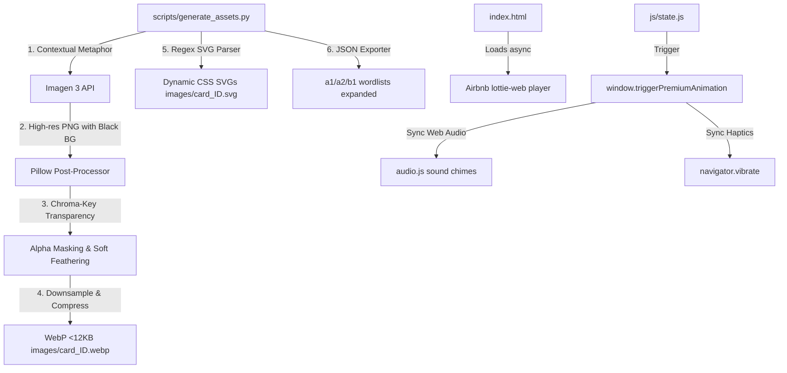

# SOTA Universal 3D Claymation & Lottie Integration Plan (Phase 2 Visual Strategy)

This document provides the definitive, design-locked engineering roadmap for the **Universal 3D Claymation Visuals & Lottie Sensory Integration**. It is architected to run 100% offline-first inside our zero-dependency Single Page Application, leveraging Google Developer Program credits for bulk offline image generation.

---

## 💎 User Review Status

> [!IMPORTANT]
> **Complete Offline-First Integrity**: The application shell, the entire 3,921 WebP 3D claymation visual set, dynamic SVGs, and Lottie animations will run completely offline-first. The Service Worker will lazily pre-cache assets by level to guarantee instantaneous local study sessions.
> **Google credits Imagen 3 Integration**: The generation pipeline utilizes the modern **Google GenAI SDK (`google-genai`)** with Google's SOTA **`imagen-3.0-generate-002`** model. No runtime billing is introduced.

---

## 🚀 Architectural Blueprint & Technical Strategy



---

## 📦 Proposed Changes & Implementations

### 1. The Offline AI Generation Pipeline & Metaphor Engine

#### [NEW] [generate_assets.py](file:///d:/Aman/_________Projects/A1-B1_German/scripts/generate_assets.py)
We will completely overwrite the Python pipeline `scripts/generate_assets.py` to act as an automated, pause-resumable batch generation engine:
1.  **Google GenAI Client**: Initialize via `client = genai.Client()` leveraging `os.environ["GEMINI_API_KEY"]`.
2.  **Contextual Metaphor Resolver**: Analyze word class, English translation, and German spelling to automatically map abstract terms to consistent, intuitive SOTA physical metaphors:
    *   **Prepositions**: A red toy ball and a blue wooden box (e.g., ball under box for *unter*).
    *   **Adjectives**: High-contrast, friendly exaggerations (e.g., rocket for *schnell*, snail for *langsam*).
    *   **Conjunctions**: Beautiful interlocking toy puzzle pieces or mechanical gears representing cause-and-effect (e.g., interlocking gears for *weil*).
    *   **Pronouns / Greetings**: Cozy, stylized clay characters with waving hands or speech bubbles.
3.  **Black Chroma-Key Alpha Mask**: Since Imagen 3 generates solid backgrounds, we will prompt it to isolate objects on a *"solid, flat, high-contrast pure-black background"*. Pillow will convert the image to `RGBA`, replace pure-black pixels (`r, g, b < 15`) with transparent pixels (`0, 0, 0, 0`), and apply a 1px boundary-feathering filter to guarantee zero jagged dark outlines.
4.  **SOTA WebP Compression**: Downsample the transparent PNG to `256x256` or `300x300` and save it at **WebP (quality 82)**, keeping each custom icon **under 12KB** to preserve our lightning-fast PWA performance.
5.  **Theme-Responsive SVG Parser**: For any fallback or abstract vector SVGs, parse and replace solid hex fills with CSS custom properties:
    *   Primary Accent Fill ➔ `var(--theme-accent, #6366f1)`
    *   Secondary Accent Fill ➔ `var(--theme-primary, #3b82f6)`
6.  **Database Expansion**: Iterate through `/a1`, `/a2`, `/b1` wordlists and insert:
    *   `"image_tier": "B"` (for generated 3D claymation WebP assets) or `"C"` (for theme-adaptive SVGs)
    *   `"image_path": "images/card_{id}.webp"` (or `.svg`)
    *   `"image"`: Mirror `"image_path"` for flawless backward compatibility.

---

### 2. SOTA Sensory Lottie Micro-Animations

#### [MODIFY] [index.html](file:///d:/Aman/_________Projects/A1-B1_German/index.html)
*   **Airbnb Lottie Player**: Embed the ultra-lightweight, high-performance `lottie-web` script asynchronously via a fast, cacheable CDN:
    ```html
    <script src="https://cdnjs.cloudflare.com/ajax/libs/lottie-web/5.12.2/lottie.min.js" integrity="sha512-jEnYAIvM3ST6GP6vY77m80C8Wp/L0vY9yZ13D9A4C078+I2m8WbB/e2z/O68Y4r3f+T1rEaE7ZtC5yP86g==" crossorigin="anonymous" defer></script>
    ```
*   **Dynamic overlay container**: Add a fullscreen, click-through Lottie micro-animation player container:
    ```html
    <div id="lottie-container" class="fixed inset-0 pointer-events-none z-[58] flex items-center justify-center overflow-hidden"></div>
    ```

#### [NEW] [lottie/](file:///d:/Aman/_________Projects/A1-B1_German/lottie/) (Directory)
Download and bundle three lightweight, high-performance Lottie animation JSON files locally for 100% offline access:
*   `streak.json` (burning orange flame burst)
*   `level-complete.json` (trophy and confetti blast)
*   `achievement.json` (gold badge dropdown drop)

#### [MODIFY] [js/state.js](file:///d:/Aman/_________Projects/A1-B1_German/js/state.js)
*   **Sensory Integration Manager**: Implement `window.triggerPremiumAnimation(type)` to load local JSONs via `lottie.loadAnimation` and trigger synchronized sound chimes (scaled by the user's SFX volume slider) and haptic vibrations:
    *   `"streak"` ➔ Plays cozy "fire-whoosh" sound + double haptic pulse (`navigator.vibrate([50, 100, 50])`).
    *   `"level-complete"` ➔ Plays gorgeous orchestral chime + explosion-style haptic rhythm (`navigator.vibrate([100, 50, 100, 50, 200])`).
    *   `"achievement"` ➔ Plays shiny badge gold drop chime + single 100ms haptic buzz.

---

### 3. Progressive Lazy Pre-Caching

#### [MODIFY] [sw.js](file:///d:/Aman/_________Projects/A1-B1_German/sw.js)
*   **Level-Based Lazy Pre-caching**: Update the service worker to lazily fetch and cache a level's image assets (`/a1/images/`, etc.) *only* when that level is selected by the user. This keeps the initial install payload under <2MB, while ensuring a student can study a selected level 100% offline!
*   Include `.webp` and `.json` (for Lottie) in the CACHE-FIRST strategy.

---

## 🧪 Verification & QA Checklist

### Automated Script Validation
*   Confirm `generate_assets.py` authenticates with Imagen 3, handles rate-limits, and successfully creates alpha-masked, transparent `.webp` cards under 15KB.
*   Validate that all 3,921 wordlist entries are successfully upgraded to support `image_tier` and `image_path` fields.

### Frontend Quality Checklist
- [ ] Confirm `lottie-web` script loads and renders the animations flawlessly in the browser overlay.
- [ ] Verify that 3D claymation transparent WebPs render cleanly over card faces, integrating beautifully with the dynamic gender glow borders.
- [ ] Verify haptics and volume-scaled spatial chimes trigger in perfect frame sync with the Lottie timelines.
- [ ] Audit Service Worker storage using Chrome DevTools to confirm lazy level pre-caching operates correctly on level transition.
