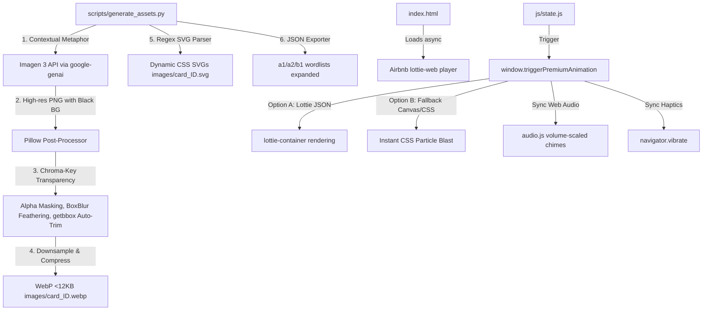

# SOTA Universal 3D Claymation & Lottie Integration Plan (Phase 2 Visual Strategy)

This document provides the definitive, design-locked engineering roadmap for the **Universal 3D Claymation Visuals & Lottie Sensory Integration**. It is architected to run 100% offline-first inside our zero-dependency Single Page Application, leveraging Google Developer Program credits for bulk offline image generation.

---

## 💎 User Review Status

> [!IMPORTANT]
> **Complete Offline-First Integrity**: The application shell, the entire 3,921 WebP 3D claymation visual set, dynamic SVGs, and Lottie animations will run completely offline-first. The Service Worker will lazily pre-cache assets by level to guarantee instantaneous local study sessions.
> **Google credits Imagen 3 Integration**: The generation pipeline utilizes the modern **Google GenAI SDK (`google-genai`)** with Google's SOTA **`imagen-3.0-generate-002`** model. No runtime billing is introduced.

### Design Decisions Locked In:
1. **Slow & High-Quality Batches**: Slicing the image generation to run super-slow and thoroughly in controlled batches of 5 to 10 words at a time to monitor progress, verify quality, and avoid rate limiting.
2. **Contextual Metaphor Resolver**: Abstract grammatical words are mapped to highly specific 3D claymation metaphors (e.g. ball-under-box for "unter") to guarantee high semantic retention.
3. **Pillow Auto-Trim & Centering**: Generated images are alpha-masked from solid black to transparent, auto-trimmed using PIL's bounding box (`getbbox()`), and centered with a clean 5% padding.
4. **Premium Dual-Engine Sensory effects**: A beautiful integration of local Lottie JSON players, with an instantaneous fallback to a high-performance CSS/Canvas particle explosion when offline or if Lottie is unavailable.

---

## 🚀 Architectural Blueprint & Technical Strategy



---

## 📦 Proposed Changes & Implementations

### 1. The Offline AI Generation Pipeline & Metaphor Engine

#### [MODIFY] [generate_assets.py](file:///d:/Aman/_________Projects/A1-B1_German/scripts/generate_assets.py)
We will completely overwrite the Python pipeline `scripts/generate_assets.py` to act as an automated, pause-resumable batch generation engine:
1. **Google GenAI Client**: Initialize via `client = genai.Client()` leveraging `os.environ["GEMINI_API_KEY"]`.
2. **Batch Control**: Accept `--limit` (default 5 or 10) and `--level` (a1, a2, b1) and `--force` arguments. It will skip words that already have generated `.webp` files in the directory to allow easy resume.
3. **Contextual Metaphor Resolver**: Analyze word class, English translation, and German spelling to automatically map abstract terms to consistent, intuitive SOTA physical metaphors.
4. **Black Chroma-Key Alpha Mask**: Convert to RGBA, perform high-speed color filtering (`r, g, b < 20`) to replace black with transparent.
5. **Auto-Trim & 5% Padding**: Run `img.getbbox()` on the transparent image, crop to the active bounding box, and center the cropped object inside a square canvas with a comfortable 5% padding border.
6. **SOTA WebP Compression**: Downsample the transparent PNG to `256x256` and save it at **WebP (quality 82)**, keeping each custom icon **under 12KB**.
7. **Database Expansion**: Iterate through wordlists and update schema fields (`image_tier`, `image_path`, `image`).

---

### 2. SOTA Sensory Lottie Micro-Animations

#### [MODIFY] [index.html](file:///d:/Aman/_________Projects/A1-B1_German/index.html)
* **Airbnb Lottie Player**: Embed the lightweight `lottie-web` script asynchronously.
* **Dynamic Overlay Container**: Add a fullscreen, click-through Lottie micro-animation player container:
  ```html
  <div id="lottie-container" class="fixed inset-0 pointer-events-none z-[58] flex items-center justify-center overflow-hidden"></div>
  ```

#### [NEW] [download_lottie.py](file:///d:/Aman/_________Projects/A1-B1_German/scripts/download_lottie.py) (Helper Script)
A helper script to fetch lightweight, high-performance Lottie JSON files locally into `lottie/streak.json`, `lottie/level-complete.json`, and `lottie/achievement.json`.

#### [MODIFY] [js/state.js](file:///d:/Aman/_________Projects/A1-B1_German/js/state.js)
* **Sensory Integration Manager**: Implement `window.triggerPremiumAnimation(type)`.
* **Fallback particle engine**: If `lottie` is not loaded or fails, create dynamic colored 2D canvas/CSS particle explosions mimicking a premium burst.
* **Synchronized Web Audio & Haptics**: Scale chimes based on `state.sfxVolume` and trigger precise `navigator.vibrate` rhythms.

---

### 3. Progressive Lazy Pre-Caching

#### [MODIFY] [sw.js](file:///d:/Aman/_________Projects/A1-B1_German/sw.js)
* **Level-Based Lazy Pre-caching**: Update the Service Worker to pre-cache the images of the *selected* level only upon switching levels, preserving minimal initial application size.

---

## 🧪 Verification & QA Checklist

### Automated Script Validation
- [ ] Confirm `generate_assets.py` successfully connects to Imagen 3, processes 5-10 word slices, and writes cropped, alpha-masked transparent WebP assets.
- [ ] Verify that updated JSON catalogs remain completely valid arrays without schema pollution.

### Frontend Quality Checklist
- [ ] Confirm the Lottie animation layer overlays correctly over cards during streak-updates, achievements, or level completions.
- [ ] Verify CSS/Canvas particle explosion fallbacks trigger flawlessly and frame-sync with SFX scaling.
- [ ] Verify Service Worker lazily caches level images on demand.
